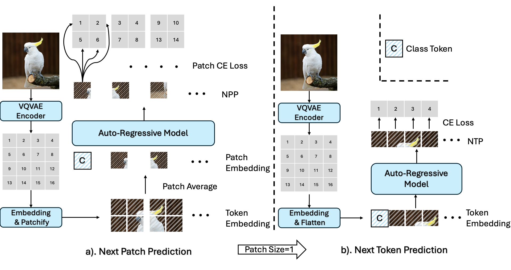
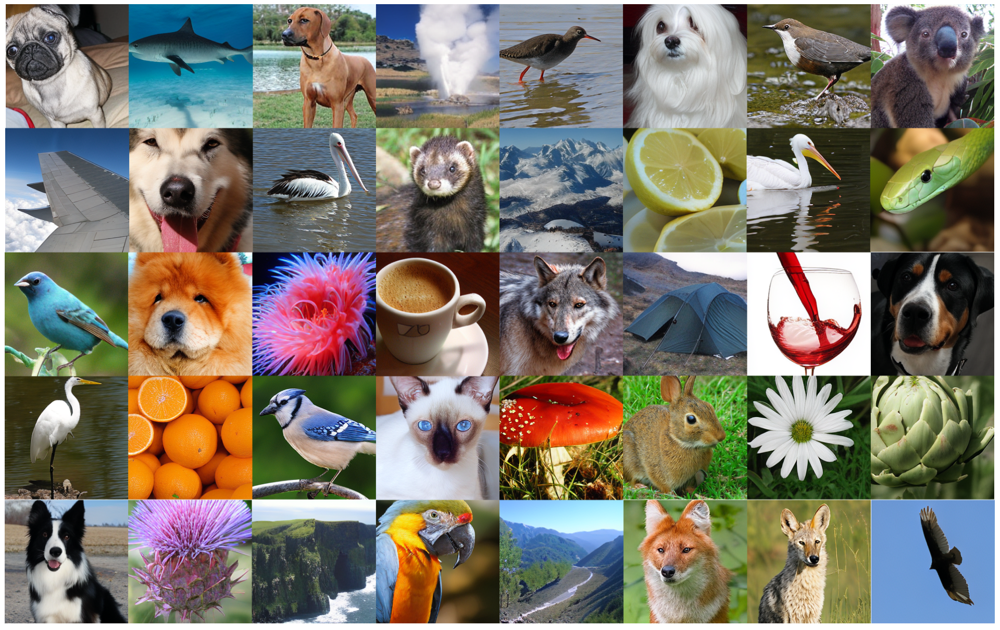
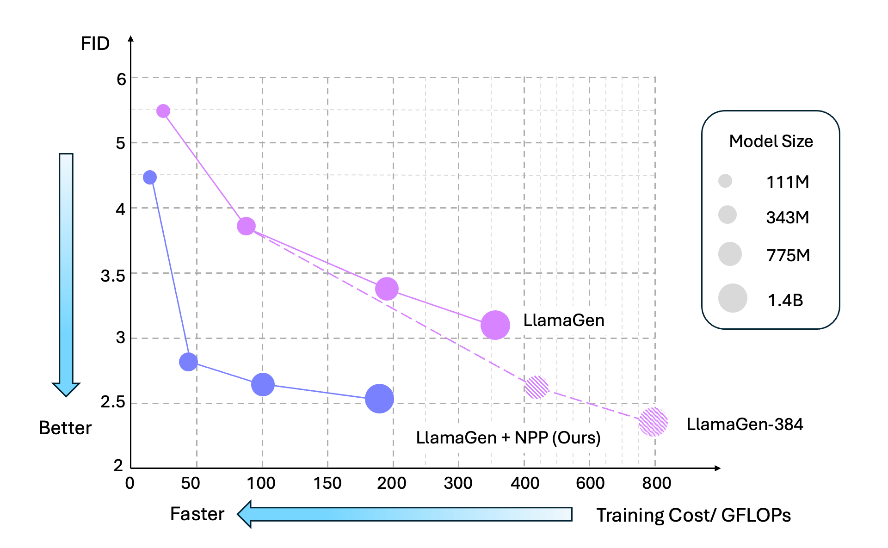

# Next Patch Prediction for Autoregressive Visual Generation, [ArXiv](https://arxiv.org/abs/2412.15321)

🎉🎉🎉 In this work, we propose a novel Next Patch Prediction (NPP) paradigm for autoregressive image generation. Our method could reduce the training cost to ∼ 0.6× while improving image generation quality by up to 1.0 FID score on the ImageNet benchmark.

🔥🔥🔥 We highlight that our method retains the original autoregressive model architecture without introducing additional trainable parameters or specifically designing a custom image tokenizer, thus ensuring flexibility and
seamless adaptation to various autoregressive models for visual generation.

<div  align="center">    
 
</div>


## Class-conditional image generation on ImageNet

### Generation results
<div  align="center">    
 
</div>


### VQ-VAE models

We use [vq_ds16_c2i.pt](https://huggingface.co/FoundationVision/LlamaGen/resolve/main/vq_ds16_c2i.pt) from [LLamaGen](https://github.com/FoundationVision/LlamaGen). Please download the model and put it in the folder `./pretrained_models`

### AR models
Method | params | training | tokens | FID (256x256) | weight 
--- |:---:|:---:|:---:|:---:|:---:|
LlamaGen-B + NPP (cfg=2.0) | 111M | DDP | 16x16 | 4.47 | [c2i_B_256.pt](https://huggingface.co/pytttttt/LlamaGen-NPP/resolve/main/c2i_B_256.pt?download=true)
LlamaGen-L + NPP (cfg=1.75) | 343M | DDP | 16x16 | 2.76 | [c2i_L_256.pt](https://huggingface.co/pytttttt/LlamaGen-NPP/resolve/main/c2i_L_256.pt?download=true)
LlamaGen-XL + NPP (cfg=1.70) | 775M | DDP | 16x16 | 2.65 | [c2i_XL_256.pt](https://huggingface.co/pytttttt/LlamaGen-NPP/resolve/main/c2i_XL_256.pt?download=true)
LlamaGen-XXL + NPP (cfg=1.65) | 1.4B | DDP | 16x16 | 2.55 | [c2i_XXL_256.pt](https://huggingface.co/pytttttt/LlamaGen-NPP/resolve/main/c2i_XXL_256.pt?download=true)

<div  align="center">    
 
</div>


## Code Usage 
#### 0.Requirements
- Linux with Python ≥ 3.7
- PyTorch ≥ 2.1
- A100 GPUs 

#### 1.Pre-extract discrete codes of training images
```
bash scripts/autoregressive/extract_codes_c2i.sh --vq-ckpt ./pretrained_models/vq_ds16_c2i.pt --data-path /path/to/imagenet/train --code-path /path/to/imagenet_code_c2i_flip_ten_crop --ten-crop --crop-range 1.1 --image-size 384
```
and/or
``` 
bash scripts/autoregressive/extract_codes_c2i.sh --vq-ckpt ./pretrained_models/vq_ds16_c2i.pt --data-path /path/to/imagenet/train --code-path /path/to/imagenet_code_c2i_flip_ten_crop_105 --ten-crop --crop-range 1.05 --image-size 384
```
#### 2.Train AR models with DDP

```
bash scripts/autoregressive/train_c2i.sh --cloud-save-path /path/to/cloud_disk --code-path /path/to/imagenet_code_c2i_flip_ten_crop --image-size 256 --gpt-model GPT-B --epoch-rate 0.5 --patch-level 2 --scheduler
```
#### 3.Sampling

```
bash scripts/autoregressive/sample_c2i.sh --vq-ckpt ./pretrained_models/vq_ds16_c2i.pt --gpt-ckpt ./pretrained_models/c2i_B_256.pt --gpt-model GPT-B --image-size 256 --image-size-eval 256 --cfg-scale 2.0
```

#### 4.Evaluation
Before evaluation, please refer [evaluation readme](evaluations/c2i/README.md) to install required packages. 
```
python3 evaluations/c2i/evaluator.py VIRTUAL_imagenet256_labeled.npz samples/GPT-B-c2i_B_256-size-256-size-256-VQ-16-topk-0-topp-1.0-temperature-1.0-cfg-2.0-seed-0.npz
```


## Acknowledgements

Our code is based on [LlamaGen](https://github.com/FoundationVision/LlamaGen). Our work is partly inspired by [Patch-Level Training for Large Language Models](https://github.com/shaochenze/PatchTrain). Thanks for their great work. 

## BibTex

```
@misc{pang2024patchpredictionautoregressivevisual,
      title={Next Patch Prediction for Autoregressive Visual Generation}, 
      author={Yatian Pang and Peng Jin and Shuo Yang and Bin Lin and Bin Zhu and Zhenyu Tang and Liuhan Chen and Francis E. H. Tay and Ser-Nam Lim and Harry Yang and Li Yuan},
      year={2024},
      eprint={2412.15321},
      archivePrefix={arXiv},
      primaryClass={cs.CV},
      url={https://arxiv.org/abs/2412.15321}, 
}
```
